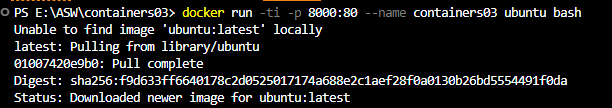
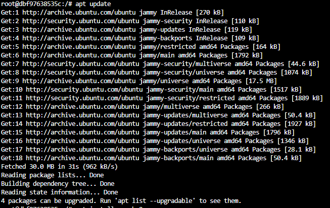
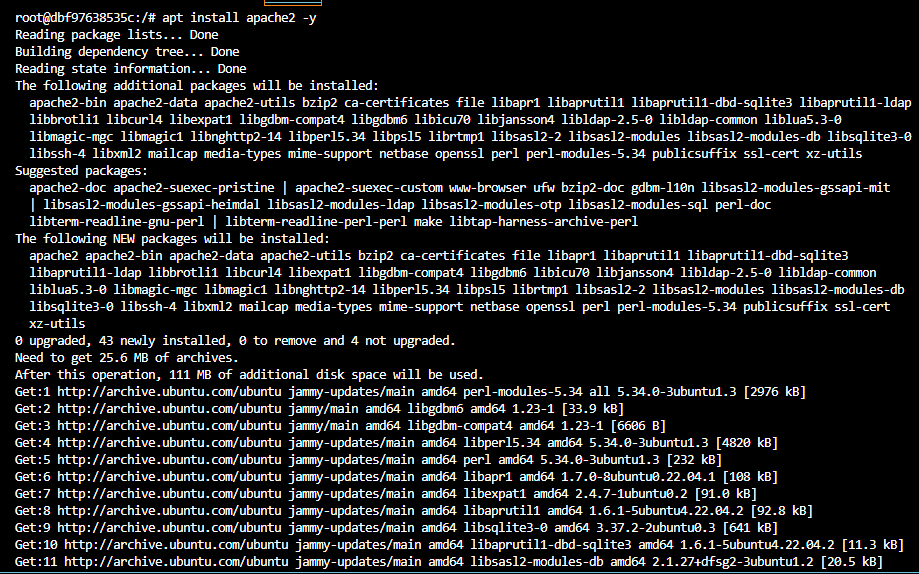
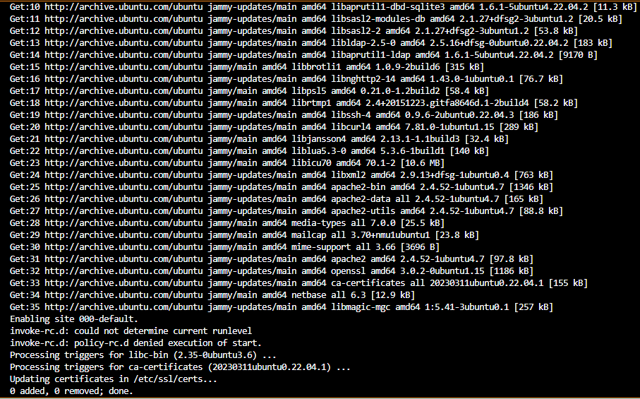
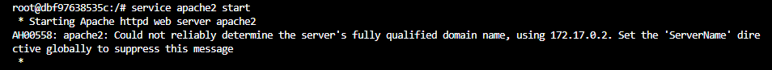
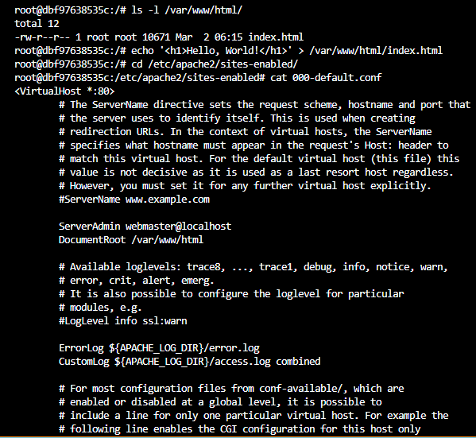
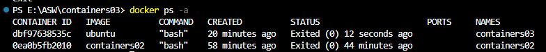

# Лабораторная работа: Установка и настройка веб-сервера Apache2 в контейнере Docker

## Цель работы
Данная лабораторная работа призвана напомнить основные команды ОС Debian/Ubuntu. Также она позволит познакомиться с Docker и его основными командами.

## Задание
Запустить контейнер Ubuntu, установить Web-сервер Apache и вывести в браузере страницу с текстом "Hello, World!".

## Описание выполнения работы
1. Открыть терминал в папке проекта `containers03`.
2. Выполнить команду `docker run -ti -p 8000:80 --name containers03 ubuntu bash`, чтобы создать и запустить контейнер Ubuntu.
   

3. В контейнере выполнить следующие команды:
   
-apt update- обновление списка доступных пакетов

-apt install apache2 -y- установление веб-сервера Apache2

-service apache2 start- запуск службы Apache2

4.Вводим в адресной строке http://localhost:8000. Видим дефолтную страницу Apache2.

5. Выполняем следующие команды:
   
-ls -l /var/www/html/- просмотр содержимого директории с веб-страницами Apache2

-echo '<h1>Hello, World!</h1>' > /var/www/html/index.html- создаем простой HTML файл index.html с текстом "Hello, World!":

7.Обновляем страницу в браузере. Видим Hello, World!

8.Выполняем следующие команды:

-cd /etc/apache2/sites-enabled/- переходим в директорию с конфигурационными файлами виртуальных хостов Apache2
-cat 000-default.conf- просмотр содержимого конфигурационного файла виртуального хоста Apache2

9.Закрываем окно терминала командой exit.

10.Просматриваем список контейнеров:
-docker ps -a

11. Удаляем контейнер: docker rm containers03

## Выводы:
В результате выполнения лабораторной работы был успешно установлен и настроен веб-сервер Apache2 в контейнере Docker на базе Ubuntu. Тестирование показало, что веб-сервер работает корректно и отображает веб-страницы.

## Используемые источники
- Документация Docker (https://docs.docker.com/)
- Документация Apache2 (https://httpd.apache.org/docs/)
